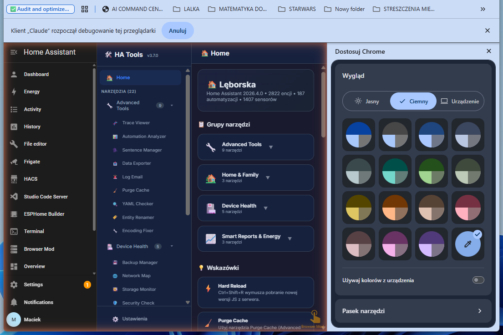

# HA Tools

All-in-one Home Assistant custom panel with 22 tools for monitoring, automation, energy management, and more.



## Installation

### HACS (recommended)
1. Add this repository as a custom repository in HACS (category: Plugin/Lovelace)
2. Install "HA Tools"
3. Add to `configuration.yaml`:

```yaml
panel_custom:
  - name: ha-tools-panel
    sidebar_title: HA Tools
    sidebar_icon: mdi:toolbox
    url_path: ha-tools
    js_url: /local/community/ha-tools/ha-tools-loader.js
    embed_iframe: false
    config:
      default_tab: trace-viewer
```

4. Restart Home Assistant

## Features

### Energy Suite (3 tools)
- **Energy Optimizer** - Real-time energy dashboard with 24h usage chart, weekly heatmap patterns, smart recommendations, and multi-period comparison (week vs week, month vs month, year vs year) with historical data from HA recorder
- **Energy Insights** - Detailed energy analytics with daily, weekly, and monthly breakdowns, cost tracking, and consumption trends
- **Energy Email** - Automated energy usage reports via email with configurable schedules and templates

All energy tools share a single energy price setting configured in HA Tools Settings > Energia.

### Advanced Tools (7 tools)
- **Trace Viewer** - Automation trace visualization with filtering, sorting, and export
- **Automation Analyzer** - Analyze automation performance and detect issues
- **Sentence Manager** - Manage Home Assistant Assist sentences
- **Data Exporter** - Export HA data to CSV/JSON
- **Log Email** - HA log reports via email
- **Purge Cache** - Clear HA frontend cache
- **YAML Checker** - Validate HA YAML configuration

### Device Health (4 tools)
- **Backup Manager** - Manage HA backups
- **Network Map** - Network device visualization
- **Storage Monitor** - Monitor HA storage usage
- **Security Check** - HA security audit

### Home & Family (4 tools)
- **Chore Tracker** - Household chore management
- **Baby Tracker** - Track feeding, sleep, diapers
- **Cry Analyzer** - AI baby cry classification
- **Vacuum Water Monitor** - Track vacuum/mop water levels

### Smart Reports & Energy (3 tools)
- Energy Optimizer, Energy Insights, Energy Email (see above)

### Other
- **Device Health** - Monitor device battery, connectivity, and status
- **Smart Reports** - Automated HA reports
- **HA Tools Discovery** - Find and manage available tools

## Shared Settings

HA Tools includes a centralized settings panel accessible via the gear icon:
- **General**: Language, theme, default tab
- **Energia (Energy)**: Shared energy price (PLN/kWh) and currency used by all 3 energy tools
- **Trace Viewer**: Custom trace viewer settings

## Architecture

```
ha-tools-loader.js  (bootstrap, loaded by panel_custom)
  +-- ha-tools-panel.js  (main panel with sidebar + tool registry)
       +-- 22 individual tool .js files
```

## Design

- Unified CSS design system with compact variables
- Dark mode support (auto-detects system preference)
- Responsive layout with mobile support
- Shadow DOM isolation for each tool
- Chart.js v4 for data visualization

## Author

MacSiem
