# HA Tools

All-in-one Home Assistant custom panel with 24 tools for monitoring, automation, energy management, and more.

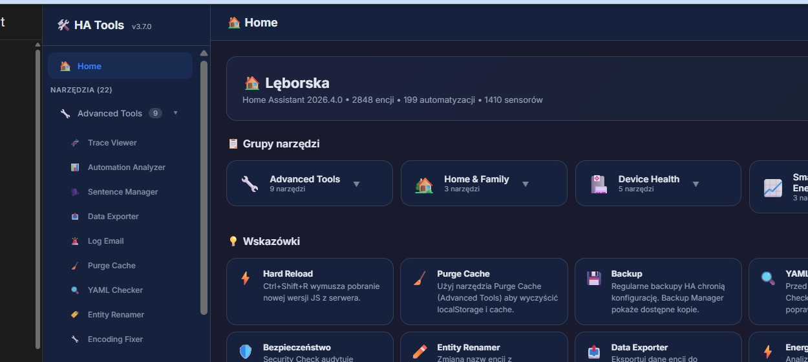

## Installation

### HACS (recommended)
1. Add this repository as a custom repository in HACS (category: Plugin/Lovelace)
2. Install "HA Tools"
3. Add to `configuration.yaml`:

```yaml
panel_custom:
  - name: ha-tools-panel
    sidebar_title: HA Tools
    sidebar_icon: mdi:toolbox
    url_path: ha-tools
    js_url: /local/community/ha-tools/ha-tools-loader.js
    embed_iframe: false
    config:
      default_tab: trace-viewer
```

4. Restart Home Assistant

## Features

### Advanced Tools (9 tools)
- **Trace Viewer** — Automation trace visualization with filtering, sorting, multi-select, and batch export (JSON/CSV)
- **Automation Analyzer** — Analyze automation performance, detect issues, and view execution statistics
- **Sentence Manager** — Manage Home Assistant Assist voice sentences
- **Data Exporter** — Export HA data to CSV/JSON with snapshots and attribute tracking
- **Log Email** — Automated HA error/warning email digest
- **Purge Cache** — Clear HA frontend cache and localStorage
- **YAML Checker** — Validate HA YAML configuration, entities, and templates
- **Entity Renamer** — Rename entities with propagation to dashboards, automations, and scripts
- **Encoding Fixer** — Detect and fix mojibake, BOM, and encoding issues in entities, files, and Lovelace resources

### Device Health (5 tools)
- **Device Health** — Monitor device battery, connectivity, and status
- **Backup Manager** — Manage and monitor HA backups with health checks
- **Network Map** — Network device visualization with topology map
- **Storage Monitor** — Disk usage visualization (WinDirStat-style treemap)
- **Security Check** — HA security audit with tips and recommendations
- **Frigate Privacy** — Pause Frigate cameras with timer and privacy schedule

### Home & Family (3 tools)
- **Chore Tracker** — Household chore management and tracking
- **Baby Tracker** — Track feeding, sleep, diapers, and growth with WHO percentile charts
- **Vacuum Water Monitor** — Track vacuum/mop water levels and service status (Roborock, Dreame, Ecovacs)

### Smart Reports & Energy (3 tools)
- **Energy Optimizer** — Real-time energy dashboard with 24h usage chart, weekly heatmap, smart recommendations, and multi-period comparison
- **Energy Insights** — Detailed energy analytics with daily, weekly, and monthly breakdowns, cost tracking, and trends
- **Energy Email** — Automated energy usage reports via email with configurable schedules

All energy tools share a single energy price setting configured in HA Tools Settings > Energia.

### Other
- **Smart Reports** — Automated HA status reports

## Screenshots

| Home | Trace Viewer |
|------|-------------|
|  | 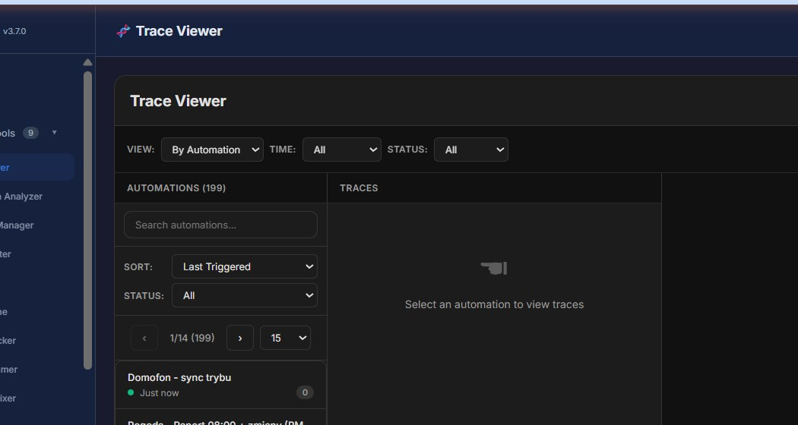 |

| Automation Analyzer | Backup Manager |
|--------------------|--------------------|
| 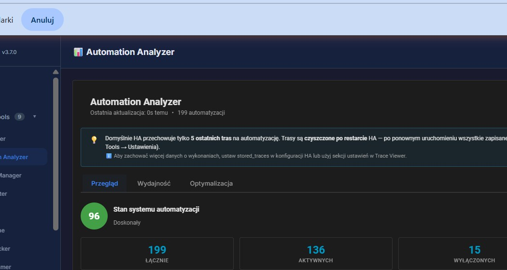 | 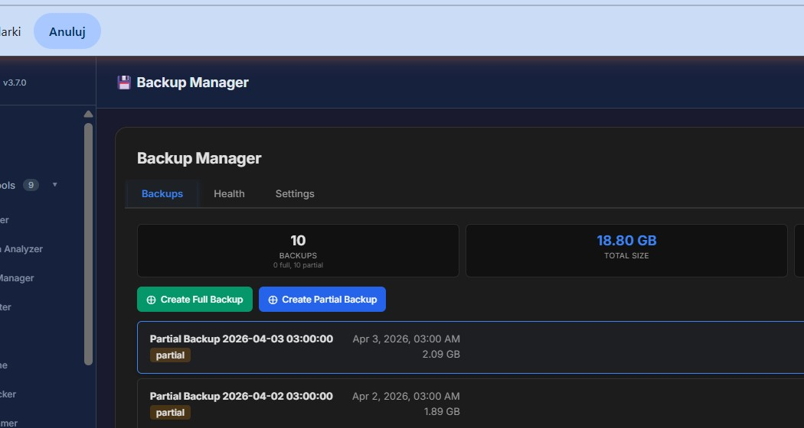 |

| Energy Optimizer | Storage Monitor |
|------------------|--------------------|
| 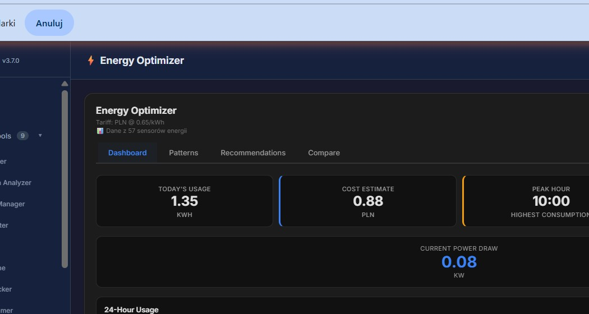 | 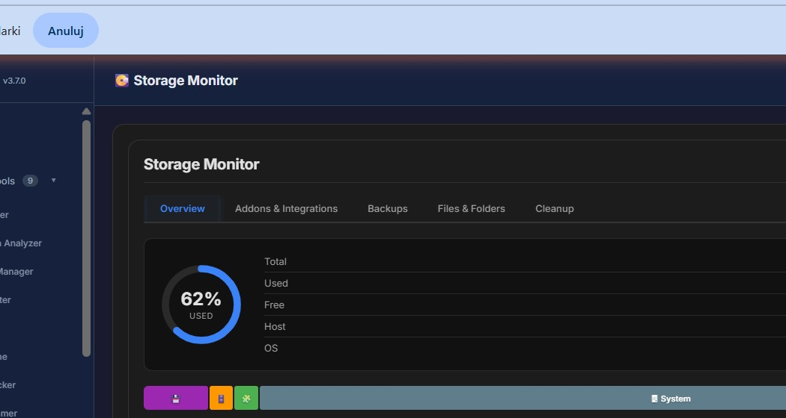 |

| Security Check | Network Map |
|----------------|-------------|
| 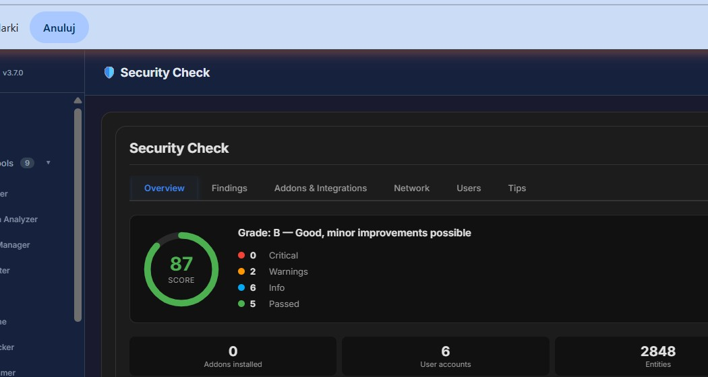 | 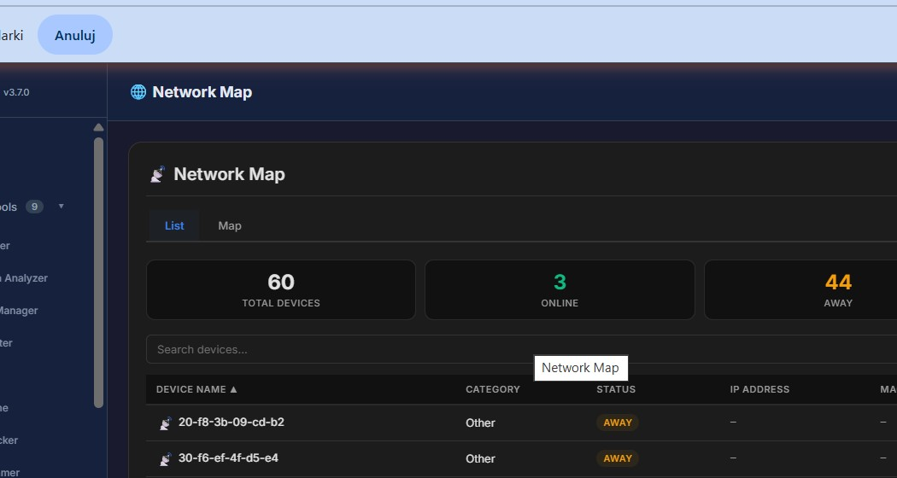 |

| Baby Tracker | Vacuum Water Monitor |
|-------------|---------------------|
| 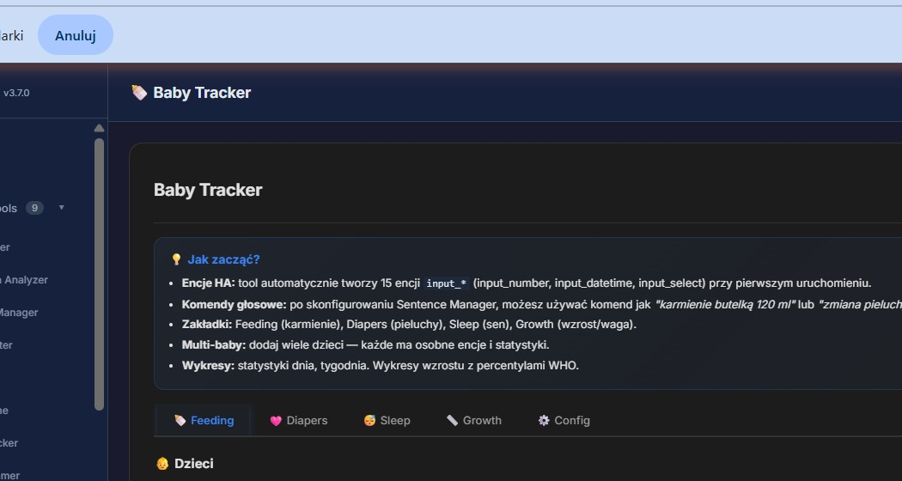 | 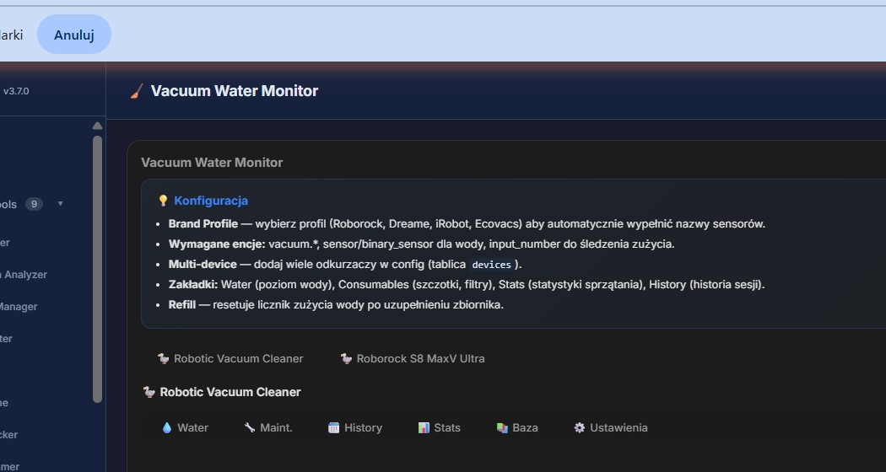 |

| Sentence Manager | Encoding Fixer |
|-----------------|----------------|
| 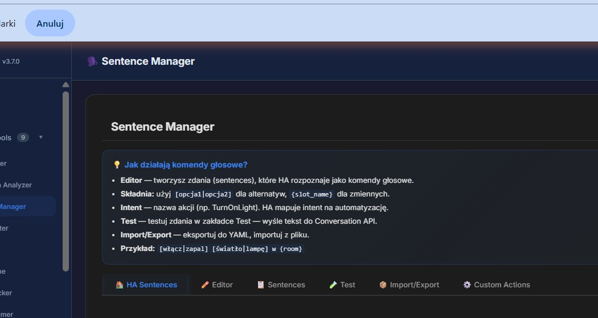 | 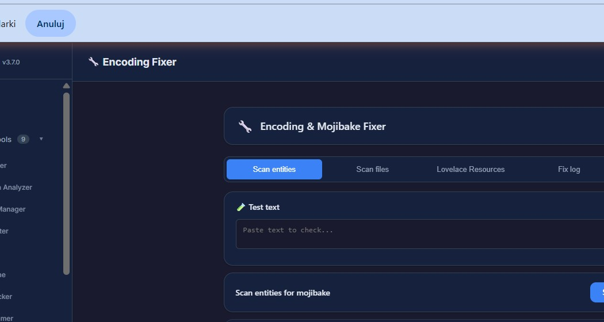 |

| Frigate Privacy |
|-----------------|
| 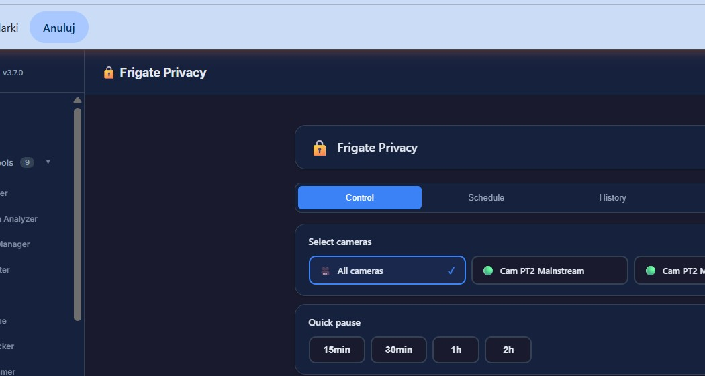 |

## Shared Settings

HA Tools includes a centralized settings panel accessible via the gear icon:
- **General**: Language, theme, default tab
- **Energia (Energy)**: Shared energy price (PLN/kWh) and currency used by all 3 energy tools
- **Trace Viewer**: Custom trace viewer settings

## Architecture

```
ha-tools-loader.js  (bootstrap, loaded by panel_custom)
  ha-tools-bento.js  (shared Bento Design System CSS)
  ha-tools-panel.js  (main panel with sidebar + tool registry)
    24 individual tool .js files (lazy-loaded on demand)
```

## Design

- Unified Bento CSS design system with compact variables
- Dark mode support (auto-detects HA theme)
- Responsive layout with mobile support
- Shadow DOM isolation for each tool
- HTML diffing to prevent flickering on re-render
- Chart.js v4 for data visualization
- Server-side persistence via HA frontend/set_user_data (cross-device)

## Changelog

### v3.7.0
- **NEW** Encoding Fixer — detect and fix mojibake in entities, YAML files, and Lovelace resources
- **NEW** Frigate Privacy — pause Frigate cameras with timer and privacy schedule
- **NEW** Shared Bento Design System CSS (ha-tools-bento.js) — single source of truth for styling
- **FIX** Server-side settings persistence (cross-device via frontend/set_user_data)
- **FIX** Improved dark mode consistency across all tools
- **NEW** 24 tools in the panel

### v3.5.0
- **FIX** Fixed card flickering — HTML diffing in all tools
- **FIX** Fixed empty cards in Security Check and Storage Monitor
- **NEW** Entity Renamer — rename entities with propagation to dashboards and automations
- **FIX** Simplified hass propagation to components
- **NEW** 22 tools in the panel

### v3.4.0
- **NEW** Purge Cache — browser cache clearing tool
- **NEW** Tool grouping with collapse/expand animation
- **NEW** 4 groups: Advanced Tools, Device Health, Smart Reports & Energy, Home & Family
- **FIX** All tools in a single ha-tools-panel/ directory
- **FIX** Fixed mojibake in YAML Checker (Polish characters and emoji)
- **NEW** Rebuilt Home with system information and tips

## Author

MacSiem
